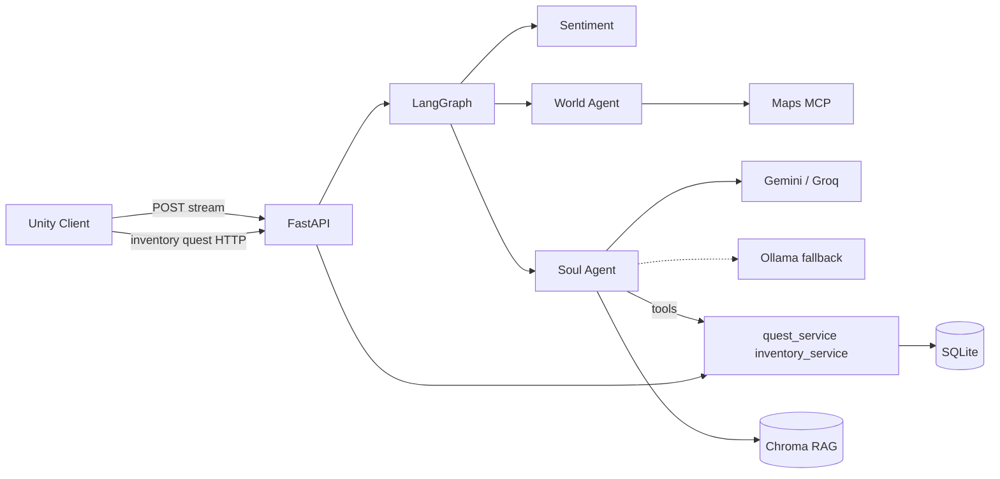
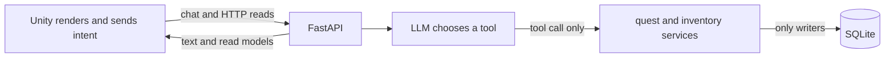

# Nebula System

Full-stack AI NPC demo: **FastAPI + LangGraph** backend, **Unity** 3D client, token streaming, in-band mood/animation/gift signals, server-authoritative inventory and quests, and multi-layer LLM fallback.

Detailed write-up (streaming): [Zenn article](https://zenn.dev/tyora/articles/dc4610389adae0)

```
nebula/
├── nebula-api/          # Python backend (FastAPI, LangGraph, Chroma RAG)
├── Nebula-Unity-Client/ # Unity 6 client (NPC interact + streaming chat)
└── docker-compose.yml   # Optional containerized API
```

## Architecture


```mermaid
flowchart LR
    Unity[Unity Client] -->|POST stream| API[FastAPI]
    Unity -->|inventory quest HTTP| API
    API --> LG[LangGraph]
    LG --> A[Sentiment]
    LG --> W[World Agent]
    LG --> S[Soul Agent]
    W --> MCP[Maps MCP]
    S --> LLM[Gemini / Groq]
    S -.-> Ollama[Ollama fallback]
    S -->|tools| Svc[quest_service inventory_service]
    API --> Svc
    Svc --> DB[(SQLite)]
    S --> RAG[(Chroma RAG)]
```

**Stream path:** LLM tokens → `yield` → HTTP body chunks → Unity `NebulaStreamHandler` → UI append.

**In-band signals:** `[[MOOD:50]]`, `[[ANIM:WAVE]]`, `[[GIFT:item_id]]`, `[[SYSTEM:OFFLINE]]` embedded in the text stream.

**Who may write the ledger**


```mermaid
flowchart LR
  Unity[Unity renders and sends intent]
  API[FastAPI]
  LLM[LLM chooses a tool]
  Svc[quest and inventory services]
  DB[(SQLite)]
  Unity -->|chat and HTTP reads| API
  API --> LLM
  LLM -->|tool call only| Svc
  Svc -->|only writers| DB
  API -->|text and read models| Unity
```

Unity does not write SQLite. The model cannot insert a row by naming an item. It can only request a tool. `quest_service` and `inventory_service` check the catalog and quest status, then write. `[[GIFT]]`, `[[MOOD]]`, and `[[ANIM]]` are presentation cues for the client.

**One turn:** the player talks to the NPC. The graph may call `mark_quest_ready` or `claim_quest_reward`. A successful claim updates quest status and grants the reward in the same transaction. The bag is `GET /api/v1/inventory/{session_id}`. An unknown, inactive, or non-grantable item id is rejected before any write, so a forged gift or reward never lands in the bag.

Layering and the log line to grep when a turn looks wrong: [`nebula-api/docs/ARCHITECTURE.md`](nebula-api/docs/ARCHITECTURE.md).

## Prerequisites

| Component | Requirement |
|-----------|---------------|
| Backend | Python 3.11+, Node.js/npx (Maps MCP), API keys |
| Unity | Unity 6, .NET / Newtonsoft.Json, Input System |
| Optional | Ollama `llama3.2` for offline soul fallback |
| Docker | Docker Desktop (optional) |

## Quick start — one command

From the repo root, with `nebula-api/.env` filled in:

```powershell
docker compose up --build
```

API: `http://127.0.0.1:8000`. Health: `GET /health`. Details and the `var/` volume are in [Quick start — Docker](#quick-start--docker).

## Quick start — Backend (local)

```powershell
cd nebula-api
python -m venv venv
venv\Scripts\activate
pip install -r requirements.txt

copy .env.example .env
# Edit .env: GOOGLE_API_KEY, GROQ_API_KEY, GOOGLE_MAPS_API_KEY

python scripts\init_rag.py
venv\Scripts\uvicorn.exe main:app --reload
```

- API: `http://127.0.0.1:8000`
- Health: `GET /health` → `{"status":"ok"}`
- Chat: `POST /api/v1/completions` (streaming)
- Inventory: `GET /api/v1/inventory/{session_id}`
- Quests: `GET/POST /api/v1/quests/{session_id}/{quest_id}/...`

Smoke test:

```powershell
.\scripts\demo.ps1
```

## Quick start — Docker

```powershell
# Ensure nebula-api/.env exists with API keys
docker compose up --build
```

The API container writes SQLite and Chroma under `/app/var` (`Settings.VAR_DIR`). Compose mounts the named volume `nebula-api-data` there, and `nebula-api-logs` at `/app/logs`.

First start may take 1–2 minutes (RAG index build + embedding model download).

```powershell
curl http://localhost:8000/health
```

**Demo tip:** set `SKIP_WORLD_NODE=true` in `.env` for faster replies during demos.

## Quick start — Unity

1. Open `Nebula-Unity-Client` in Unity 6
2. Open `Assets/_Project/Scenes/SampleScene.unity`
3. Select the object with **Nebula Manager** → confirm **API Base Url** = `http://127.0.0.1:8000/api/v1/completions` (or `localhost`)
4. Play → walk to the NPC → press **F** for the interact menu
5. **Talk** starts a session and opens the chat panel; **Bag** / **Quest** appear after Talk
6. **Esc** (or leaving the trigger range) closes UI and unlocks movement

### Font setup (CJK + Japanese)

MSYH covers Chinese/English. For Japanese kana, add fallback once in Editor:

**MSYH SDF → Fallback Font Assets → `NotoSansJP-Regular SDF`**

(`NotoSansJP` assets live under `Assets/_Project/Art/Fonts/`.)

## API keys

| Variable | Purpose |
|----------|---------|
| `GOOGLE_API_KEY` | Gemini (primary) |
| `GROQ_API_KEY` | Groq fallback |
| `GOOGLE_MAPS_API_KEY` | Maps MCP / world tools |

See `nebula-api/.env.example` for all options.

## Not in this phase

- Combat
- A demo video
- Filtering in-band tags while they stream. Tokens are yielded before `sanitize_npc_reply`, so a live bubble can show an illegal tag. The message stored for history is sanitized. Inventory and quest rows do not change because of tags.
- Scoring reply quality. `python evals/run_eval.py` checks routes, rejections, quest outcomes, and fallback. It does not call Gemini, Groq, or Ollama.

## Verify

From `nebula-api`, after `pip install -r requirements-dev.txt`:

```powershell
ruff check app tests evals
pytest
python evals/run_eval.py
```

CI on `nebula-api/**` runs the same three steps.

## Development status

| Area | Phase | Status |
|------|-------|--------|
| **Phase 0** — refactor & engineering | nebula-api A–G | ✅ v1.0, token streaming, pytest + CI |
| | Unity client 0–3 | ✅ streaming UI, modular layout, API URL + JP fonts |
| | Demo & Ship | ✅ Docker, `/health`, README, `demo.ps1` ([#23](https://github.com/bshcl/nebula/pull/23), [#24](https://github.com/bshcl/nebula/pull/24)) |
| **Phase 1** — gameplay loop | Quests, inventory, gift grant, NPC F-interact | ✅ claim loop, grid bag, `send_gift`→`grant_item`, move lock ([#27](https://github.com/bshcl/nebula/pull/27), [#29](https://github.com/bshcl/nebula/pull/29), [#30](https://github.com/bshcl/nebula/pull/30)) |
| **Phase 1** — quality | Reject / quest / fallback eval, CI gate, per-turn summary | ✅ [#36](https://github.com/bshcl/nebula/pull/36), [#37](https://github.com/bshcl/nebula/pull/37), [#38](https://github.com/bshcl/nebula/pull/38) |
| **Follow-up** | Streaming tag filter | Recorded. Does not block the ledger. See [Not in this phase](#not-in-this-phase). |

## License

Personal learning / open-source project. Font licenses: see `Assets/TextMesh Pro/Fonts/` and `NotoSansJP` (OFL).
