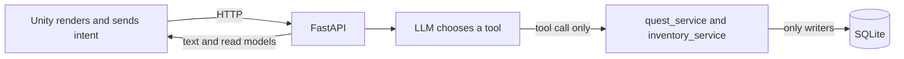

# Architecture

Two rules decide where new code goes. Everything else follows from them.

## Rule 1: `agentkit` is the reusable half, `game` is the Nebula half

`app/agentkit/` holds the Agent machinery that has nothing to do with Nebula:
model construction and fallback, output guardrails, per-request tracing,
retrieval, MCP clients. It is meant to be lifted out into a standalone package
later, so it must never import from `app.game`.

`app/game/` holds everything that only makes sense inside Nebula: who Sakura is,
what a quest is, how mood works.

If you cannot describe a piece of code without naming a Nebula character, item
or rule, it belongs in `game`. Otherwise it belongs in `agentkit`.

## Rule 2: dependencies point one way

```
api  ->  game  ->  agentkit  ->  infra / config / shared
```

`api` knows about `game`. `game` knows about `agentkit`. Nothing points back up.
The one deliberate exception is `app/config/__init__.py` importing
`agentkit.observability.logging` to wire logging at startup — that is the
composition root doing its job, not a layer violation.

## Runtime boundary

Unity renders and sends intent. It does not write the ledger.



A talk turn can ask the soul agent to mark a quest ready or claim a reward. The tool runs Python that checks the item catalog and quest status, then writes quest status and the reward in one transaction. The bag is a read of that table. Naming an item in the reply does not insert a row. Unknown, inactive, or non-grantable ids are rejected before any write. `[[GIFT:]]` is a client cue after a successful grant.

**Known follow-up:** `/completions` yields tokens before `sanitize_npc_reply`. A live bubble can show an illegal or partial tag. The message saved to SQLite is sanitized. Inventory and quest rows are unchanged by tags.

## Where new things go

| You are adding | Server location | Notes |
|---|---|---|
| A gameplay domain (battle, party, crafting) | `app/game/<domain>/` | Own `service.py`, `defs.py`, and a graph if it needs one |
| HTTP routes for that domain | `app/api/v1/<domain>.py` | Register in `app/api/v1/__init__.py`; `main.py` never changes |
| Request/response models | `app/schemas/<domain>.py` | One module per domain |
| New database tables | `app/infra/models.py` | Single `Base` so `create_all` stays complete |
| A new LLM provider or fallback strategy | `app/agentkit/llm/` | Keep it parameterized, no Nebula names |
| A new guardrail | `app/agentkit/guardrails/` | |
| Authored content (lore, dialogue text) | `app/content/` | Committed to git |
| Anything generated at runtime | `var/` | Gitignored; never commit |

## When a chat turn looks wrong

Every log line is prefixed `rid=<request_id> sid=<session_id>`. Grep one `rid=` to see that turn.

At the end of `/completions`, one line starts with `chat_turn_complete`. Its fields answer:

| Field | Question |
|---|---|
| `route` | Which path ran (`angry`, `world`, or `soul`) |
| `tool_rejections` | Did a tool pre-check refuse a call, or `none` |
| `fallbacks` | Did a model or node fall back, or `none` |
| `guardrail_violation_count` | How many output-guardrail hits (names in `guardrail_violations`) |
| `duration_ms` | How long the turn took |

Guardrail hits are not fallbacks. A stripped `[[ANIM:]]` tag does not mean the cloud model failed.

## Tests and evals mirror the source tree

`tests/agentkit/`, `tests/game/`, `tests/api/`, `tests/shared/`, `tests/evals/`.
A test for `app/game/quests/service.py` goes in `tests/game/`.

Golden cases live in `evals/cases/`, one YAML per suite. `load_cases()` reads
the whole directory, so adding `battle.yaml` requires no code change.

## Battle system, concretely

When multi-agent turn-based combat lands, it is a new domain and nothing else
moves:

- `app/game/battle/` — turn resolution, intent blackboard, teammate agents
- `app/api/v1/battle.py` — routes, registered in the v1 aggregate router
- `app/schemas/battle.py` — request/response models
- `evals/cases/battle.yaml` — golden cases for decision quality
- `tests/game/test_battle_*.py`

The coordination logic that turns out to be domain-agnostic (blackboard,
conflict resolution, planning loops) graduates into
`app/agentkit/orchestration/` once a second consumer exists — not before.
